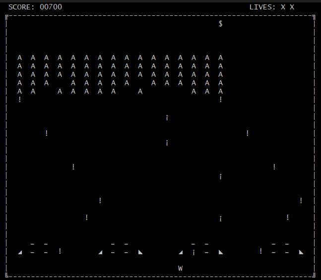
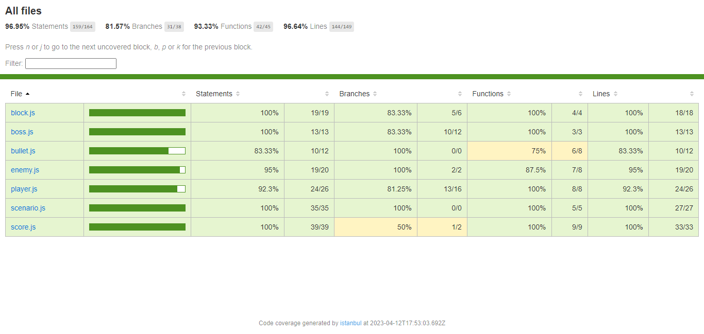

# **Space Invades Game with JavaScript**

## **Problem Description**
Aliens from space are invading the earth, what would we do?

Space invaders group in the sky and move together synchronously from top to bottom in a quest for trying to conquer earth. They randomly shot in earth direction where one spaceship will try to stop them.

Incomplete list of things the game needs:
- group of aliens moving from top to bottom, swinging from side to side, shoot to spaceship
- spaceship moving in one line at the bottom, shoots to aliens
- blocks that can be used as protection, but that deteriorates with each hit from any shoot
- super alien ships moving at the top of the screen, they do not attack, but give extra points if hit by spaceship

Demo: https://freeinvaders.org/

## **Solution Proposed**

with the implementation of the modules, clases and respective test files, this is the proposal for the problem:

### Execution of the code

### Execution of unit tests

